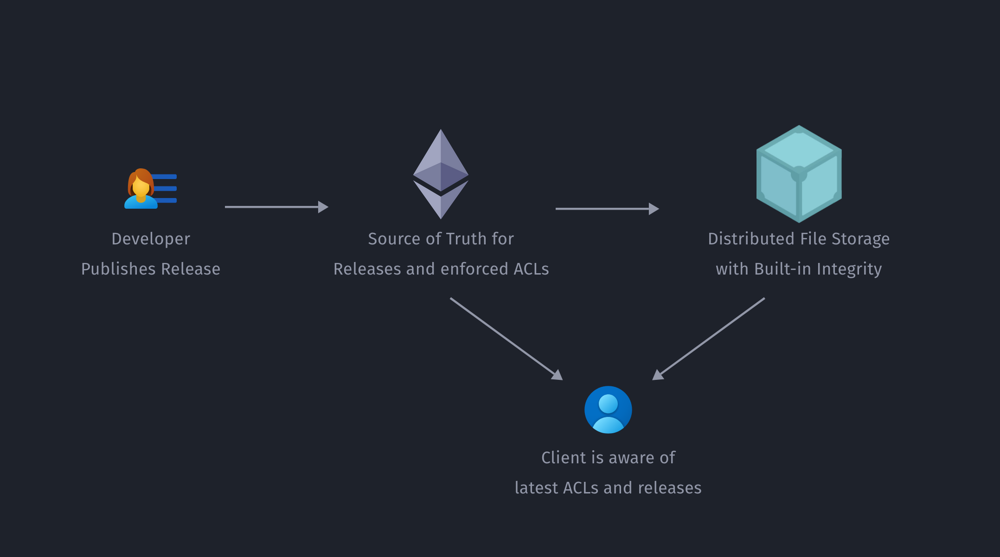

# Valist

)

A software/firmware/binary data notary system, similar to the concept that Apple uses to digitally sign and secure applications, but open to developers to extend and integrate into almost any system, traditional or decentralized.

## Motivation

Secure (and simplified) software updating is a common problem within IoT, traditional systems, and many cases now, dApps. Typically, it is necessary to roll your own upgrading solution, or be stuck with a centralized app store acceptance and delivery process. The former is ineffective, as constant re-implementation of a process that should be as secure as possible dramatically increases risk, while the latter is ineffective since you are tied to a central entity that manages your distribution on your behalf (i.e., requires permission).

The idea is to leverage Ethereum, IPFS and/or Filecoin to create a public "base" layer for a simplified binary repository that both integrates with traditional systems and is built upon decentralized protocols. Smart contracts on Ethereum manage the latest source of truth for binary data stored in another layer such as IPFS and/or Filecoin. Clients can then query the software notary for the latest version of some software and be pointed to a verifiable, decentralized store.

Imagine the following scenario:

* A developer wants to distribute a new firmware version for a hardware wallet (or some other arbitrary software) they have been building in a secure, verifiable way.

* Using a simple frontend, the developer registers their credentials (one or more public keys, perhaps leveraging ERC-725) to the software notary dApp. This can also be organization-level credentials, with individual developer/team access control.

* The developer then signs the firmware with a private key associated with the public identity.

* The developer uploads the firmware to the binary store (IPFS/Filecoin) using the simple frontend, and can set any relevant metadata such as version number, update notes, etc.

* The registry (on Ethereum, and potentially other blockchains in the future) is updated with the latest verified version.

* Clients with the software installed automatically detect the change and proceed to notify and/or trigger an auto-update.

Here's a visual of what this flow looks like:

The primary goal for this software is to integrate with both traditional (centralized) and decentralized systems. Enterprises would benefit significantly from flexible notary systems just as much as future technologies.

As for the open source community, the ability to securely host code in a decentralized way is essential. While it is possible to spin up say, a Debian mirror, it might not be as approachable or commonplace, and places the onus of security and maintenance on the contributor. A system like this could make it easy as possible for a contributor to simply "check a box" next to their favorite app/dApp and help bear the load, without having to worry as much about security or configuration.

This is also a major use-case that could help folks see the tangible value of blockchain/decentralized protocols outside of monetary applications, as it can increase security in many existing systems.

One of the main challenges with this project is providing different clients that require various levels of integrity checking. For example, one should be able to use cURL to fetch this data. This should serve most people's needs while adding lots of ancillary benefits. Common public mirrors can operate in the same fashion as many current systems, and users and enterprises will have the freedom to self-host and contribute storage to the public network, or create their own internal or private notaries.

### Architecture Overview

To start, we are providing a simple web frontend and HTTP relay that can be deployed locally or on a server, and a shared library that will be used in a future CLI (and other clients). The intent is to be CI/CD friendly in the future, enabling automatic publishing of cryptographically verifiable software.

### Current implementation

So far, the current implementation of Valist looks like this:

### What's next

* [x] Full-featured Web UI

* [x] (Basic) Support for NPM registries

* [ ] Filecoin integration

* [ ] CLI and CI/CD support

* [ ] Deployment tooling for Relays

* [ ] Encryption Support

## Documentation

Documentation for how to get started with Valist can be found at [https://docs.valist.io](https://docs.valist.io)
