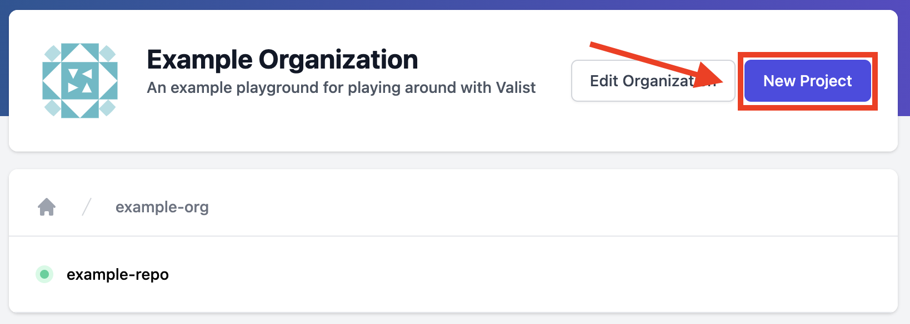
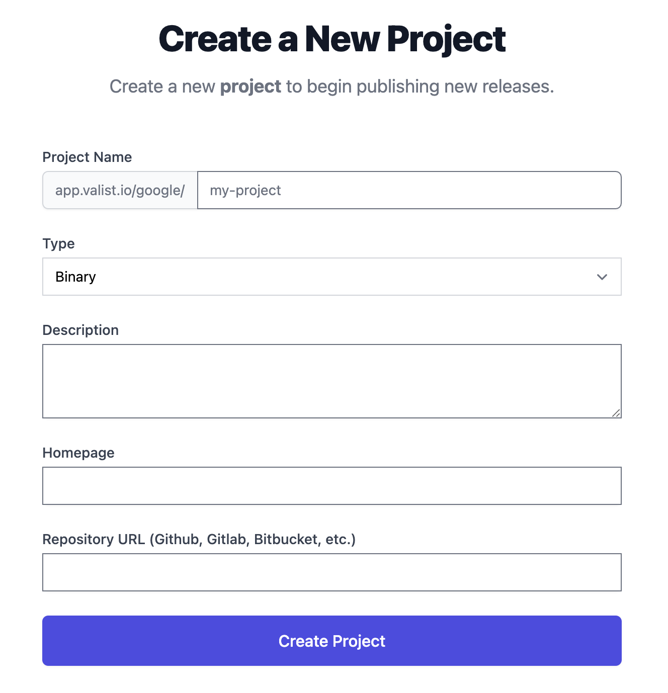

# Creating a Repository

After you have created an organization, you are ready to create a repository. Creating a repository allows you to mange, publish, and retrieve your software releases on Valist.

## CLI

To create a new repository on from the CLI, call `valist repo:new` and pass it your `organization` and your `repository name`.

```bash
valist repo:new orgName repoName
```

## Web

To create a new repository from the web interface navigate to the [Valist dashboard](https://app.valist.io) and login.

Next, from your dashboard, select the organization that you would like to create a repository under.

{ width=600px }

On the repository page, click `Create Project`.

{ width=600px }

Fill out your repositories `Shortname`, `Type`, and `Description` and click `Create Project`. Keep in mind if you are logged in with `MetaMask`, you will be prompted for a signature confirmation.

{ width=600px }

## SDK

To create a new repository using the Valist SDK, create a new javascript file containing the following:

```javascript
  import Valist from '@valist/sdk';
  const HDWalletProvider = require('@truffle/hdwallet-provider');

  const key = "<key>";
  const orgName = "<orgName>";
  const repoName = "<repoName>";
  const metaData = {
      name: 'Awesome Project',
      description: 'The coolest project in the world',
      homepage: 'https://cool.project',
      repository: 'https://github.com/',
      projectType: 'binary',
    };

  const web3Provider = new HDWalletProvider({
    privateKeys: [key],
    providerOrUrl: 'https://rpc.valist.io',
  });

  const valist = new Valist({ web3Provider });

  (async () => {
    const { transactionHash } = await valist.createRepository(orgName, repoName, metaData);

    console.log(transactionHash);
  })();
```
