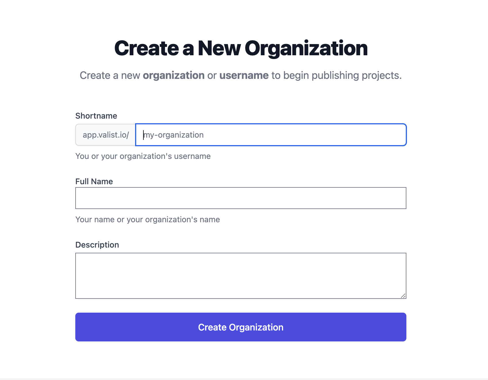

# Creating an Organization

Creating an organization is the first step to publishing software on valist! Organizations are how users are able to manage their various software repositories and admin credentials on valist. Each organizations receives a unique `valist-ID` which is then linked to a namespace that is governed by the members (keys) of the organization.

## CLI

To create and organization from the cli it's as simple as running `valist org:new` and passing it the name of the organization that you would like to create.

```bash
  valist org:new exampleOrg
```

## Web

To create a new organization from the web interface navigate to the [valist dashboard](https://app.valist.io) and login.

Upon successful login, you will be greeted by the following welcome message displaying your current address and a new button, `Create Organization`.


After clicking `create organization` you will be navigated to the create organization page.



Fill out your organizations `Shortname`, `Full Name`, and `Description` and click `Create Organization`, keep in mind if you are logged in with `meta-mask` you will be prompted for a signature confirmation.
