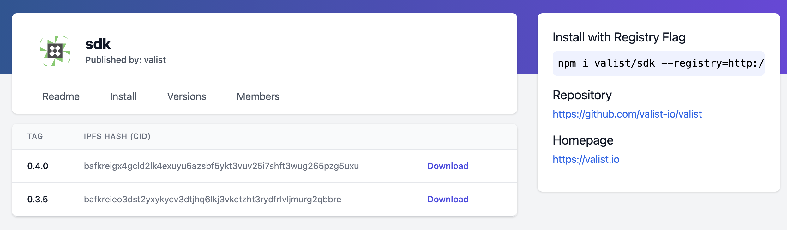

# Fetching & Installing Software

## Binary Executables

### Web

To download a binary release artifact from the Web UI, navigate to the target repository's profile page (https://app.valist.io/`<orgName>`/`<repoName>`), and then choose your desired release from the release list.

{width="600px"}

### SDK

Binary artifacts can be downloaded using the Valist SDK by filling in a web3 provider and running the following code:

```javascript
const Valist = require('@valist/sdk');

(async () => {
  const valist = new Valist({ web3Provider: YOUR_WEB3_PROVIDER, metaTx: false });
  await valist.connect();

  const releases = await valist.getReleasesFromRepo('valist', 'sdk');

  const latest = await valist.getLatestRelease('valist', 'sdk');

  console.log(releases);
})();
```

## NPM Packages

### Registry

Each **node** package repository published on valist is accessible via the valist relay API at [https://app.valist.io/api/npm](https://app.valist.io/api/npm).

To install a package directly from a repository simply append the `npm --registry` flag:

```bash
npm install <examplePackage> --registry=https://app.valist.io/api/npm
```

Or set a valist relay as you're default **NPM registry**:

```bash
npm config set registry https://app.valist.io/api/npm
```

### Web

To download an **NPM package** from the web-UI navigate to the target repository's profile page (https://app.valist.io/`<orgName>`/`<repoName>`), and then choose your desired release from the release list.

{width="600px"}

### SDK

Npm packages can be downloaded using the **Valist-SDK**  by filling in a web3 provider and running the following code:

```javascript
const Valist = require('@valist/sdk');

(async () => {
  const valist = new Valist({ web3Provider: YOUR_WEB3_PROVIDER, metaTx: false });
  await valist.connect();

  const releases = await valist.getReleasesFromRepo('valist', 'sdk');

  console.log(releases);
})();
```
