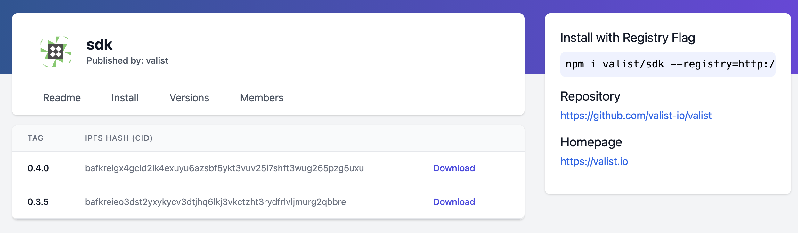

# Fetching & Installing Software

## CLI

To install a binary artifact run the following.

```bash
valist install acme-co/go-example/0.1.6-rc.0
```

The CLI will detect your current platform and install the correct artifact into your `~/.valist/bin` directory.

## Web

To download a release artifact from the Web UI, navigate to the target repository's profile page (https://app.valist.io/`<orgName>`/`<repoName>`), and click `versions`, then choose your desired release from the release list.

{width="600px"}

## SDK

Artifacts can be downloaded using the Valist SDK by filling in a web3 provider and running the following code:

```javascript
const Valist = require('@valist/sdk');

(async () => {
  const valist = new Valist({ web3Provider: YOUR_WEB3_PROVIDER, metaTx: false });
  await valist.connect();

  const releases = await valist.getReleases('valist', 'sdk');

  const latest = await valist.getLatestRelease('valist', 'sdk');

  console.log(releases);
})();
```

[Example Node SDK Project](https://github.com/valist-io/example-projects/tree/main/sdk-node)

## NPM Registry

Every **npm** repo type published on Valist is accessible via the relay API at [https://valist.io/api/npm](https://valist.io/api/npm).

To install an npm package, you'll need to link your organization to the Valist registry, then install!

```bash
echo @acme-co:registry=https://valist.io/api/npm >> .npmrc

npm i @acme-co/npm-example
```